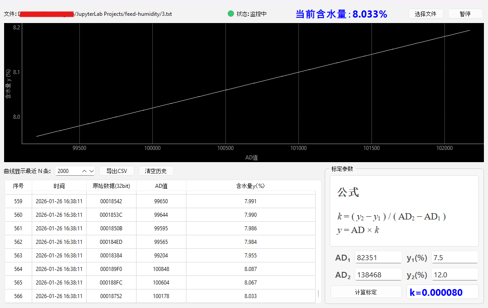

该应用程序能够读取远程湿度传感器以txt文件格式写入的原始数据。随后，该应用程序将这些原始数据转换为可读的湿度值，并及时在屏幕上显示。除了以图表和表格的形式展示这些值外，用户还可以将它们保存为csv文件。
#### 环境
Python 3.8/3.9 in Windows 11
#### 命令行安装必要的包（这里用清华的镜像）
```cmd
pip install pyserial PySide6 pyqtgraph pyinstaller -i https://pypi.tuna.tsinghua.edu.cn/simple
```
#### 命令行运行程序
```cmd
python main.py
```
#### 命令行将程序打包成Windows可执行文件（.exe）
```cmd
pyinstaller -F -w -i icon.ico main.py --name "力源饲料水分监测仪" --add-data "icon.ico;."
```
> 完成后会在当前工程目录生成一个`dist`文件夹，打开该文件夹即可看到`力源饲料水分监测仪.exe`，鼠标双击可运行。
#### 软件界面

